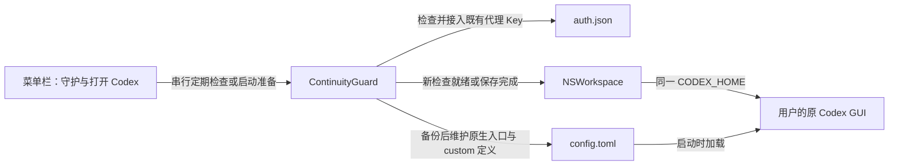
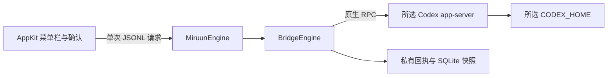

# Miruun 配置守护与初始化分析

日期：2026 年 10 月 3 日。包含 Miruun 0.4.1、已合并的 `custom` 历史接入修复及启动前准备入口，源码版本未变。分析对象为 `/Users/pixelkernel/Downloads/ContextBridgeSwift` 的本地交付，以及与当前接入问题相关的公开版本化源码。修改落在 Miruun，原下载目录保持原样。当前构建与测试事实见 [VALIDATION.md](../VALIDATION.md)。

## 当前方向：一次启用，维护 openai 与缺失的 custom 接入

最新需求是在切换接入后继续原来的对话，并省去手动等待配置就绪。Miruun 保留数据目录、一次启用、状态、暂停和可选登录启动，后台每两秒串行检查配置；菜单与设置提供“打开 Codex”，把准备和启动串起来。

当前最小实现是维护 `CODEX_HOME/config.toml` 的原生 `openai` 标识与入口，并在切回官方文件 ChatGPT/OAuth 登录时补齐缺失的 `custom` 定义。不会读取或批量改写 sessions/SQLite，不恢复线程，也不发用户回合。启动入口在守护启用时先重新检查，通过后由 `NSWorkspace` 打开 `com.openai.codex`，传入同一个 `CODEX_HOME`；不直接启动或修改内嵌后端。当前还支持 CC Switch 在 provider 中配置 `experimental_bearer_token` 的形态：复用这份本机代理 Key，在备份后为内置入口写入 Codex API Key 文件认证。所有变更均等待客户端与后端退出，Key 不进入状态或日志。

这一范围与产品目标之间还有明确边界：历史 provider ID 不会自动变成 `openai`，缺失定义的自动修复仅针对已知 `custom` ID；其他数据目录、云端资产与任意跨供应商上下文兼容不在本次实现中。保留入口配置不是活动 GUI 已热切换、上游账户已更换或所有原对话已成功续聊的运行证明。

## 为什么保留 openai 标识

本次核对了 Codex 的精确标签 `rust-v0.159.2`，没有以当前 main 或通用文档替代具体机制。

| 版本化源码证据 | 对方案的影响 |
| --- | --- |
| 恢复旧线程时，没有显式模型覆盖就从持久 metadata 取回模型和 provider ID：[thread_processor.rs L230–240](https://github.com/openai/codex/blob/rust-v0.159.2/codex-rs/app-server/src/request_processors/thread_processor.rs#L230-L240)、[恢复配置 L3923–3955](https://github.com/openai/codex/blob/rust-v0.159.2/codex-rs/app-server/src/request_processors/thread_processor.rs#L3923-L3955) | 全局换成一个新 provider ID，不足以使原生 `openai` 旧线程跟随 |
| `ThreadSettingsSnapshot` 保存模型、provider ID、cwd 与权限等，不保存完整 endpoint/auth：[protocol.rs L2210–2238](https://github.com/openai/codex/blob/rust-v0.159.2/codex-rs/protocol/src/protocol.rs#L2210-L2238) | 同一个 provider ID 可在新配置加载时解析到当前定义，通常无需逐条改写历史 |
| 当前配置先以 `openai_base_url` 构建 builtin providers，再按 ID 查找定义：[config/mod.rs L3799–3822](https://github.com/openai/codex/blob/rust-v0.159.2/codex-rs/core/src/config/mod.rs#L3799-L3822) | 通过顶层 `openai_base_url` 维护原生 `openai` 接入；保留完整 URL 路径 |
| `openai` 是保留 ID，普通 configured provider 合并不会覆盖已存在 builtin：[保留 ID](https://github.com/openai/codex/blob/rust-v0.159.2/codex-rs/config/src/config_toml.rs#L66-L72)、[合并 L690–721](https://github.com/openai/codex/blob/rust-v0.159.2/codex-rs/model-provider-info/src/lib.rs#L690-L721) | 不写 `[model_providers.openai]` 来假装覆盖 builtin |
| builtin OpenAI 使用 Responses，要求 OpenAI auth，并有自己的 WebSocket/能力设置：[provider 定义 L519–557](https://github.com/openai/codex/blob/rust-v0.159.2/codex-rs/model-provider-info/src/lib.rs#L519-L557) | 目标为本机 Responses 接入；全局 API Key 或明确的 inline bearer 可接入，其他自定义 provider 语义不能只复制地址 |

[官方高级配置文档](https://developers.openai.com/codex/config-advanced/)也列出顶层 `openai_base_url` 的代理用途，并明确 builtin provider ID 不能覆盖。项目本地配置对 provider/auth 等敏感键有限制；这里不能把项目配置简单描述为另一条可自由改路由的来源。CLI、桌面 host 和受管理配置的实际覆盖则仍可能超出根文件检查范围。

Codex 0.159.2 的 `thread/list` 默认还会按当前 provider 筛选，而显式空的 `modelProviders` 包含所有 provider：[thread_processor.rs L5481–5490](https://github.com/openai/codex/blob/rust-v0.159.2/codex-rs/app-server/src/request_processors/thread_processor.rs#L5481-L5490)。保留原生 `openai` ID 也避免靠新增 ID 来切断原生历史列表的配置一致性；补齐 `custom` 定义不能证明 GUI 会列出全部 `custom` 历史。Miruun 的守护不调用这个接口，也不查询历史来计算覆盖数量。

## 已合并修复：停用代理后 custom 历史无法加载

2026-10-03 的故障是用户停用 CC Switch + CLIProxyAPI、回到账号 A 后，打开此前以 `custom` 创建的对话时出现 `Model provider custom not found`。旧历史保留 provider ID，而当前 `config.toml` 已不再定义它；恢复流程在发出模型请求前就无法解析 provider。仅恢复全局 `model_provider = "openai"` 或移除本机地址，不能解决这个缺失引用。

修复复用配置守护：当前根 provider 为原生 `openai`（或省略）、认证来自受支持的 ChatGPT/OAuth 文件且缺少 `custom` 时，追加以下定义。它保留历史 ID，不修改会话文件或 SQLite。

```toml
[model_providers.custom] # miruun-managed-custom-provider
name = "OpenAI"
wire_api = "responses"
requires_openai_auth = true
```

`base_url` 刻意省略。Codex 0.159.2 在此字段缺失时根据实际认证模式选择官方默认地址，ChatGPT 认证使用其 Codex 后端入口：[认证相关默认地址 L421–438](https://github.com/openai/codex/blob/rust-v0.159.2/codex-rs/model-provider-info/src/lib.rs#L421-L438)。`name = "OpenAI"` 保留该版本的 OpenAI provider 判定及后端路由能力判断：[L607–618](https://github.com/openai/codex/blob/rust-v0.159.2/codex-rs/model-provider-info/src/lib.rs#L607-L618)。此定义默认使用 HTTP SSE，没有复制 builtin 的全部能力，也不保证 WebSocket 等价。

已有未标记的 `custom` 定义仍由用户或接入工具管理，原样保留。Miruun 只维护自己生成且内容仍完整匹配的定义：之后切回有效的本机 API Key 接入时，为其同步完整 `openai_base_url`；回到 OAuth 时删除该定义的 `base_url`，并按原规则清理自己标记的根地址。管理块被修改、含额外字段或非本机地址、标记异常，以及无法安全追加的 inline table 都会停止调整。缺失 `custom` 的首次补齐只发生在官方 OAuth 模式，不在任意 API Key 配置下新建别名。

此次在隔离的合成数据环境中使用实际 Codex 后端复现了原错误；补齐定义后以同一 ID 冷恢复，并在切回 mock 代理后成功重放历史。各次 `thread/resume` 均未传入模型或 provider 覆盖。PR #1 已合并，用户重启应用后确认回到账号 A 可以继续此前的 `custom` 对话。这是该故障场景的用户实测反馈，不证明完整 A → B → A、全部历史、上游归属或新启动入口的实机验收。具体运行记录见 [VALIDATION.md](../VALIDATION.md)。

## 0.4.1 修正的实际兼容缺口

0.4.1 开发时的本机只读核对确认，当时 CC Switch 的 provider 使用 `requires_openai_auth = false` 和 `experimental_bearer_token`，地址为本机 CLIProxyAPI；`auth.json` 原本不存在。这是 provider 自行提供认证的有效形态，不能把文件缺失判断成权限异常或用户未配置代理 Key。0.4.0 的纯文件认证假设使守护提前停止，旧 openai 历史仍会尝试官方入口。

用户明确接受切换成代理 API Key 模式后，方案补上了认证接入：保留所有原生 openai 历史的标识，复用当前 provider 的代理 Key，同时维护全局认证与本机地址。不会创建上游账户、生成新的 Key，或把 provider 的凭据丢弃后只复制 URL。

实际桌面应用为 `/Applications/ChatGPT.app`（bundle `com.openai.codex`）。在隔离 HOME/CODEX_HOME/XDG 中确认其内嵌后端为 `codex-cli 0.159.2`，并使用两个 localhost mock 端口、合成 Key 和历史完成冷恢复：同一线程保留 ID、模型和 provider，第二个入口收到预期 Bearer、第一轮输入与回复以及第二轮输入。该验证限制后端不能访问真实用户文件和其他网络，使用 HTTP SSE；它不等于真实 GUI/账号 B 验收，详见验证记录。

手动启动窗口也有实际缺陷：0.4.0 记住首次显示设置后，后续启动静默且没有处理 reopen。0.4.1 对手动启动和 reopen 显示设置窗口；系统登录启动事件单独处理，登录静默仍需实机验收。

## 当前后台调用链与写入边界



守护读取当前用户拥有的普通文件，拒绝路径链接、硬链接、异常所有权、超限内容和无法安全解析的 TOML。它要求连续两次 `config.toml` 与 `auth.json` 内容相同，保存前再次核对两者，先保存私有配置备份，再以临时文件、原子替换与目录同步完成配置写入。接管时还备份原 auth，或记录 auth 原来不存在；配置与认证备份均含敏感信息，只留在本机私有目录。两文件按认证先、配置后的顺序分别提交，避免先切换入口却仍保留旧 OAuth 或缺失认证；每个数据目录的 pending 标记与阶段回执记录半提交，异常和崩溃重开不会自动重试或回滚。

接管为本机代理入口的自定义 provider 必须包含完整 `base_url`，`wire_api` 省略或为 `responses`。认证可使用显式 `requires_openai_auth = true` 配合现有 API Key 文件，或 false 配合 `experimental_bearer_token`；后者可在 auth 文件缺失时接管，也可备份后将原文件 OAuth 认证切换为 API Key。地址仅允许明确的 loopback HTTP/HTTPS，保留端口与路径；自定义认证、请求头、查询参数和其他额外 provider 字段会阻止转换，避免复制 URL 时遗失路由与认证条件。profiles、已知登录覆盖和非 file 凭据存储也会停止处理。

认证模式的正确持久值是 `"apikey"`，不是 `"api_key"`。显式认证模式优先于 API Key 是否存在：[auth manager L1763–1779](https://github.com/openai/codex/blob/rust-v0.159.2/codex-rs/login/src/auth/manager.rs#L1763-L1779)。默认文件认证可做静态检查；显式 auto/keyring/ephemeral 不可从 auth.json 推断当前认证。外部或临时认证、环境与 host 覆盖仍是未由本次守护证实的运行边界。

本工具写入的根 `openai_base_url` 行以注释 `# miruun-managed-openai-base-url` 标记。纯 OAuth、当前 provider 为 `openai`、地址仍为 loopback 且标记准确时，守护经过同样的稳定采样、备份与最终比较，删除这条根地址行并维护上述 `custom` 定义，不改变模型、根 provider 或 auth。未标记的根地址、根地址已被改成其他目标，或当前选中的自定义 provider 无法接入受支持的代理认证时停止，不自动恢复旧配置。

写入前及提交前均检查 Codex 客户端/后端已退出。原子 rename 不能让不合作的其他写入者参与锁定；最终比较之后仍有外部写入的窗口。备份与稳定采样减少已观察冲突，不能证明跨程序写入互斥。暂停和退出会等待当前检查结束，以免流程被界面动作中断。

启动请求复用守护串行队列和两秒调度，不使用旧状态放行；即使不需要修改配置，也要求两次稳定采样。客户端仍活动时重置稳定窗口并等待，不强制退出；重复请求合并，暂停或退出取消尚未发出的启动，错误可观察。可选“打开 Miruun 时自动打开 Codex”让手动首次启动和 reopen 直接进入相同入口；关闭该选项或暂停守护时仍显示设置，错误也会显示设置。系统登录项启动始终静默。模式由当前文件配置与认证决定，不探测代理在线状态来猜测账户意图，也不恢复旧 OAuth 备份。

选择应用外的前置入口是为了保证准备发生在配置加载之前。[官方 hooks 文档](https://learn.chatgpt.com/docs/hooks)将 `SessionStart` 定义为会话启动事件；本机 Codex 0.159.2 核对确认，[配置阶段就会拒绝缺失的 provider](https://github.com/openai/codex/blob/rust-v0.159.2/codex-rs/core/src/config/mod.rs#L3812-L3820)，发生在该事件之前，因此不能用它修复本次加载失败。直接使用原 Codex 启动入口绕过 Miruun，仍没有先行保证；已经存在的会话也不会因此热切换。

本机桌面包 `26.928.21956` 另有目录传递边界：`app.asar` 中 `startup-requirements-Da3KfG8r.js` 在读取后端配置前合并登录 shell 的环境；`application-network-startup-D74LEWDz.js` 以用户登录 shell、`-ilc` 及继承环境获取变量，再把合并后的 `CODEX_HOME` 传给本机后端。因此仅给 `NSWorkspace` 设置变量可能被 shell 中的固定导出覆盖。启动入口复用 `NativeDiscovery`，以相同参数和四个 shell 初始化标志只输出该目录，拒绝不匹配、空值或执行失败；随后重新读配置与客户端状态。单次 timer 在检查完成两秒后再次安排采样，避免慢 shell 后补发事件缩短稳定窗口。

这项预检核实的是探测进程的结果，不能证明按父进程、cwd 或命令内容分支的任意 shell 脚本与桌面进程等价；这些覆盖不在支持保证内。未使用 `CODEX_ELECTRON_USER_DATA_PATH` 来保护变量，因为同一桌面包也用它覆盖 GUI 数据路径并改变 macOS 单实例锁行为。上述安装包机制仅对本机核对版本成立，不能当作未来版本的稳定公开 API。

主 GUI 已不调用早期 helper/原生恢复流程。原 `MiruunEngine`、备份、事务与测试保留为研究代码；旧单线程 UI、`BridgeRunner`、`ConfirmationSheet` 与 UI 私有未决状态已移除。旧 helper 独立入口仍没有原 UI 的持久未决保护，不能把它当作当前产品的操作入口。

## 活动会话、代理与跨账号连续性

Codex 的 `ModelClient` 是 session-scoped，构造参数应在会话生命期内保持稳定：[client.rs L470–518](https://github.com/openai/codex/blob/rust-v0.159.2/codex-rs/core/src/client.rs#L470-L518)。app-server 配置管理也明确说明已有线程保留 session route：[config_manager.rs L261–268](https://github.com/openai/codex/blob/rust-v0.159.2/codex-rs/app-server/src/config_manager.rs#L261-L268)。认证管理还有缓存与显式 reload 路径。因此根文件已更新不能独立证明活动 GUI 下一回合已采用新 endpoint 或 auth；首次配置维护后需要 GUI 重载的运行验收。

固定本机代理地址、在代理侧调整已授权的上游，是减少客户端变更的自然方向。但本次也核对了 CLIProxyAPI 的精确标签 `v7.3.16`，其公开源码显示实际连接连续性仍有条件：

| 代理机制 | 可以得出的结论 |
| --- | --- |
| 原生 WebSocket passthrough 要求 pinned auth 与当前 upstream auth ID 相同；带 `previous_response_id` 或 append 依赖当前 upstream：[websocket.go L869–877](https://github.com/router-for-me/CLIProxyAPI/blob/v7.3.16/sdk/api/handlers/openai/openai_responses_websocket.go#L869-L877) | 增量续接依赖连接及认证关联，稳定入口本身不能取消这个条件 |
| 对依赖旧连接的请求，凭据不能在原连接中轮换；相关失败会让客户端新连接完整重放：[websocket.go L737–744](https://github.com/router-for-me/CLIProxyAPI/blob/v7.3.16/sdk/api/handlers/openai/openai_responses_websocket.go#L737-L744)；完整 `response.create` 可以建立新 transport：[L502–514](https://github.com/router-for-me/CLIProxyAPI/blob/v7.3.16/sdk/api/handlers/openai/openai_responses_websocket.go#L502-L514) | 账号变化可能需要重连及完整历史重发，尚未验证本机 GUI 是否在各类场景中正确完成 |
| upstream 连接匹配包含 auth ID、WebSocket URL 与 proxy URL；目标不同会分离旧连接：[session.go L377–434](https://github.com/router-for-me/CLIProxyAPI/blob/v7.3.16/internal/runtime/executor/codex_websockets_session.go#L377-L434)、[重新连接 L594–619](https://github.com/router-for-me/CLIProxyAPI/blob/v7.3.16/internal/runtime/executor/codex_websockets_session.go#L594-L619) | 换账号并不只是相同 URL 下无状态地继续用旧连接 |
| GPT reasoning 的签名校验明确只检查 Fernet-like 外层格式，不证明可解密：[gpt_validation.go L21–24](https://github.com/router-for-me/CLIProxyAPI/blob/v7.3.16/internal/signature/gpt_validation.go#L21-L24) | 既不能据此承诺跨账号 reasoning 可重放，也不能据此断言所有 reasoning 都按账号加密且必然失败 |
| reasoning replay cache 只对 Claude 输入转换启用：[reasoning.go L52–72](https://github.com/router-for-me/CLIProxyAPI/blob/v7.3.16/internal/runtime/executor/codex_executor_reasoning.go#L52-L72) | 不把该缓存当作原生 Codex Responses 的通用上下文迁移机制 |

0.4.1 开发时的本机代理只读 `/v1/models` 检查返回 HTTP 200，26 个模型中包含当时配置模型；未发送真实对话请求，也没有验证账户 B、计费归属、压缩历史重放、工具状态或所有原对话的实际回复。代理源码的恢复设计和隔离后端的合成冷恢复提供机制依据，不能代替这些运行事实。后续验收应保持多个原生原对话及 `custom` 原对话，分别检查回到官方账号、冷重载、固定入口的上游变更、活动 WebSocket 重连、压缩与工具调用，并核对实际请求路径。

## 历史：0.3.1 单线程初始化分析

以下保留初始交付审查与修复记录。其 UI 选择、逐线程确认、helper 和真实线程验收计划属于已经被后台守护替代的旧产品流程；原生引擎修复和测试仍是保留源码的历史证据。当前支持范围、隐私说明和后续验收以前文及当前产品说明为准。

日期：2026 年 10 月 2 日。分析对象为 `/Users/pixelkernel/Downloads/ContextBridgeSwift` 的本地交付，修改落在 Miruun，原下载目录保持原样。当前构建证据见 [VALIDATION.md](../VALIDATION.md)。

### 结构判断

原交付是 Context Bridge 0.3.0：15 个 Swift 实现文件、5 个测试文件、64 个 XCTest 方法，采用 SwiftPM，面向 macOS 13+。产品说明的 Miruun 0.3.1 名称、图标母版和文档中引用的 `check-source.py` 未完整反映在交付目录中。

现有结构已经能承载产品，不需要增加服务层、WebView、账户系统或另一套存储。保留两条必要边界：AppKit 界面与有界引擎子进程之间的 JSONL；引擎与实际 Codex app-server 之间的原生 RPC。`BridgeCore` 和 `BridgeEngine` 内部模块沿用原名，面向用户的应用、helper、bundle 和记录目录统一为 Miruun。



### 核心调用链

`MenuAppDelegate` 负责选择与单次确认；`OperationGate` 阻止忙碌状态下重复操作，`PrivateState.begin` 在启动变更 helper 前持久保存未决标记。`BridgeRunner` 固定调用同包 helper，校验请求关联、输出大小与单一最终结果，主队列更新界面。

`NativeEngine.handle` 分发发现、目录、预检、切换和只读复核。目录使用 `thread/list` 的 `useStateDbOnly`，不扫描完整历史作为预览。配置解析使用受限 TOML 子集，不能识别或存在歧义时拒绝；origin 脱敏只表达配置接收方，不宣称有效运行路由。

预检检查客户端关闭、精确候选版本、协议字段、六项实际功能状态、空队列、线程状态、标题、项目和原模型，生成十分钟有效的一次性 manifest。切换再次核对目标、配置摘要和后端版本，然后读取原身份、备份，再执行事务。

`NativeBackup` 验证 rollout 的 session_meta ID 和文件类型，拒绝链接、异常文件与超限记录；通过只读 SQLite 源连接复制已提交状态。回执、快照及目录写入包含持久化检查，失败保留不完整证据。

`NativeTransaction.perform` 先在变更进程中以目标 provider 和原模型调用 `thread/resume`，要求原 ID 和有效设置一致，正常关闭后，再通过新进程、不传 provider/model 覆盖地恢复并核对。不会调用 `turn/start`、fork、设置更新或认证写操作。

### 确认并修复的问题

| 问题与触发条件 | 初始化中的处理 | 验证 |
| --- | --- | --- |
| 名称、版本与交付说明不一致，文档引用脚本和图标未交付 | 应用/包/helper/记录目录改为 Miruun 0.3.1；文档区分历史背景和当前验证，未伪造资源 | 包、plist 与构建产物核对 |
| 当前 SDK 的搜索框 delegate 要求 NSSearchFieldDelegate，原类只遵守 NSTextFieldDelegate | 遵守继承后者的 NSSearchFieldDelegate | Mac 编译与链接 |
| Foundation 会把 `/private/var` 与 `/private/tmp` 简化为 symlink 别名，导致临时探测和存储安全检查失败 | 显式路径不再经 Foundation 标准化；工具自建临时目录用 POSIX realpath 获取物理路径，用户路径仍拒绝 symlink 与点路径 | 实际 Mac 存储/配置测试与合成 schema 探测 |
| 身份检查后新增排队消息，未发送 resume 却被统一记录为 uncertain | 保留明确停止证据，沿已有停止回执路径解除临时标记；timeout、意外回合和未知本地错误仍锁定 | 事务与 NativeEngine 跨层回归 |
| 预检绑定的版本变为另一个已允许版本仍可执行 | 执行前要求版本与 manifest 完全一致 | 已允许版本之间变更的拒绝回归 |
| WAL 源的快照带 WAL 格式标记，孤立只读查询出现 SQLITE_CANTOPEN | 完成 backup 后仅在新建快照上设独占锁并转换为 DELETE 日志模式，确认实际返回模式，不修改源库或删除 sidecar | 已提交 WAL 内容、只读查询、无 WAL/SHM 回归 |
| 成功结果与界面旧 provider 同时显示 | 同步更新所选行和身份说明 | 编译；实际交互仍待 GUI 验收 |
| 小屏初始尺寸与固定最小 frame 尺寸冲突 | 以屏幕可用 content 尺寸决定初始及最小窗口尺寸 | 编译；小屏和确认面板仍待视觉验收 |

### 协议证据与限制

[OpenAI 官方 app-server 文档](https://developers.openai.com/codex/app-server/)明确区分 resume、fork 和只读 read；resume 保留既有线程。通用文档不能替代具体版本的持久化证明。

针对源码的两个精确候选标签，官方版本化 `Thread` 定义包含 `model: Option<String>`，表示加载时的配置模型或最近持久模型，未知为 null：[0.159.2 定义](https://github.com/openai/codex/blob/rust-v0.159.2/codex-rs/app-server-protocol/src/protocol/v2/thread_data.rs#L242-L246)、[0.159.0-alpha.7 定义](https://github.com/openai/codex/blob/rust-v0.159.0-alpha.7/codex-rs/app-server-protocol/src/protocol/v2/thread_data.rs#L242-L246)。因此通过 thread/read 核对原模型、缺失时停止的方向合理；没有为取模型提前恢复线程。

`sourceAuditedCandidate` 只由版本字符串和必要输入 schema 匹配得出，不证明二进制签名、来源或文件哈希。后端行为仍需运行验收；本次没有执行实际 Codex 后端。

持久未决标记由正常 UI 流程拥有。内部 helper 的 flock 仅串行同一记录目录的当前操作，不扫描历史 uncertain 回执，也不提供独立操作入口的完整保护；不应绕过界面自行发 switch 请求。Miruun 没有迁移旧 ContextBridgeMenu 的状态目录，原目录及证据不会自动删除。

复核和冷恢复的成功不能证明 GUI 路由、最终上游账户、计费归属、实际回复或跨供应商压缩上下文兼容性。进程检测基于进程列表和已知名称，有并发启动及未知客户端的边界；全过程仍需用户保持客户端关闭。

### 分析覆盖与后续验收

直接阅读了全部原始实现、测试、构建脚本和 plist；分别沿 UI/JSONL 和引擎/存储/RPC 链核对状态与错误路径，执行本机合成测试，并为原先缺少的跨层、实际子进程和 schema 探测补充测试。没有读取真实私人会话、凭据或数据库，没有进行真实线程切换。

下一阶段按验证清单执行 GUI 小屏与可访问性、强退重开、真实客户端进程与受支持后端协议验收；之后经针对真实原对话的明确同意再验证续聊和实际请求路径。签名、公证、图标与洁净机器分发另属发布验收，不由单元测试推断完成。
