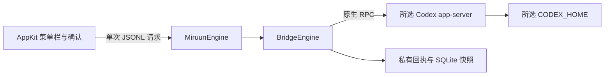

# ContextBridgeSwift 分析与 Miruun 初始化

日期：2026 年 10 月 2 日。分析对象为 `/Users/pixelkernel/Downloads/ContextBridgeSwift` 的本地交付，修改落在 Miruun，原下载目录保持原样。当前构建证据见 [VALIDATION.md](../VALIDATION.md)。

## 结构判断

原交付是 Context Bridge 0.3.0：15 个 Swift 实现文件、5 个测试文件、64 个 XCTest 方法，采用 SwiftPM，面向 macOS 13+。产品说明的 Miruun 0.3.1 名称、图标母版和文档中引用的 `check-source.py` 未完整反映在交付目录中。

现有结构已经能承载产品，不需要增加服务层、WebView、账户系统或另一套存储。保留两条必要边界：AppKit 界面与有界引擎子进程之间的 JSONL；引擎与实际 Codex app-server 之间的原生 RPC。`BridgeCore` 和 `BridgeEngine` 内部模块沿用原名，面向用户的应用、helper、bundle 和记录目录统一为 Miruun。

## 核心调用链

`MenuAppDelegate` 负责选择与单次确认；`OperationGate` 阻止忙碌状态下重复操作，`PrivateState.begin` 在启动变更 helper 前持久保存未决标记。`BridgeRunner` 固定调用同包 helper，校验请求关联、输出大小与单一最终结果，主队列更新界面。

`NativeEngine.handle` 分发发现、目录、预检、切换和只读复核。目录使用 `thread/list` 的 `useStateDbOnly`，不扫描完整历史作为预览。配置解析使用受限 TOML 子集，不能识别或存在歧义时拒绝；origin 脱敏只表达配置接收方，不宣称有效运行路由。

预检检查客户端关闭、精确候选版本、协议字段、六项实际功能状态、空队列、线程状态、标题、项目和原模型，生成十分钟有效的一次性 manifest。切换再次核对目标、配置摘要和后端版本，然后读取原身份、备份，再执行事务。

`NativeBackup` 验证 rollout 的 session_meta ID 和文件类型，拒绝链接、异常文件与超限记录；通过只读 SQLite 源连接复制已提交状态。回执、快照及目录写入包含持久化检查，失败保留不完整证据。

`NativeTransaction.perform` 先在变更进程中以目标 provider 和原模型调用 `thread/resume`，要求原 ID 和有效设置一致，正常关闭后，再通过新进程、不传 provider/model 覆盖地恢复并核对。不会调用 `turn/start`、fork、设置更新或认证写操作。

## 确认并修复的问题

| 问题与触发条件 | 初始化中的处理 | 验证 |
| --- | --- | --- |
| 名称、版本与交付说明不一致，文档引用脚本和图标未交付 | 应用/包/helper/记录目录改为 Miruun 0.3.1；文档区分历史背景和当前验证，未伪造资源 | 包、plist 与构建产物核对 |
| 当前 SDK 的搜索框 delegate 要求 NSSearchFieldDelegate，原类只遵守 NSTextFieldDelegate | 遵守继承后者的 NSSearchFieldDelegate | Mac 编译与链接 |
| Foundation 会把 `/private/var` 与 `/private/tmp` 简化为 symlink 别名，导致临时探测和存储安全检查失败 | 显式路径不再经 Foundation 标准化；工具自建临时目录用 POSIX realpath 获取物理路径，用户路径仍拒绝 symlink 与点路径 | 实际 Mac 存储/配置测试与合成 schema 探测 |
| 身份检查后新增排队消息，未发送 resume 却被统一记录为 uncertain | 保留明确停止证据，沿已有停止回执路径解除临时标记；timeout、意外回合和未知本地错误仍锁定 | 事务与 NativeEngine 跨层回归 |
| 预检绑定的版本变为另一个已允许版本仍可执行 | 执行前要求版本与 manifest 完全一致 | 已允许版本之间变更的拒绝回归 |
| WAL 源的快照带 WAL 格式标记，孤立只读查询出现 SQLITE_CANTOPEN | 完成 backup 后仅在新建快照上设独占锁并转换为 DELETE 日志模式，确认实际返回模式，不修改源库或删除 sidecar | 已提交 WAL 内容、只读查询、无 WAL/SHM 回归 |
| 成功结果与界面旧 provider 同时显示 | 同步更新所选行和身份说明 | 编译；实际交互仍待 GUI 验收 |
| 小屏初始尺寸与固定最小 frame 尺寸冲突 | 以屏幕可用 content 尺寸决定初始及最小窗口尺寸 | 编译；小屏和确认面板仍待视觉验收 |

## 协议证据与限制

[OpenAI 官方 app-server 文档](https://developers.openai.com/codex/app-server/)明确区分 resume、fork 和只读 read；resume 保留既有线程。通用文档不能替代具体版本的持久化证明。

针对源码的两个精确候选标签，官方版本化 `Thread` 定义包含 `model: Option<String>`，表示加载时的配置模型或最近持久模型，未知为 null：[0.159.2 定义](https://github.com/openai/codex/blob/rust-v0.159.2/codex-rs/app-server-protocol/src/protocol/v2/thread_data.rs#L242-L246)、[0.159.0-alpha.7 定义](https://github.com/openai/codex/blob/rust-v0.159.0-alpha.7/codex-rs/app-server-protocol/src/protocol/v2/thread_data.rs#L242-L246)。因此通过 thread/read 核对原模型、缺失时停止的方向合理；没有为取模型提前恢复线程。

`sourceAuditedCandidate` 只由版本字符串和必要输入 schema 匹配得出，不证明二进制签名、来源或文件哈希。后端行为仍需运行验收；本次没有执行实际 Codex 后端。

持久未决标记由正常 UI 流程拥有。内部 helper 的 flock 仅串行同一记录目录的当前操作，不扫描历史 uncertain 回执，也不提供独立操作入口的完整保护；不应绕过界面自行发 switch 请求。Miruun 没有迁移旧 ContextBridgeMenu 的状态目录，原目录及证据不会自动删除。

复核和冷恢复的成功不能证明 GUI 路由、最终上游账户、计费归属、实际回复或跨供应商压缩上下文兼容性。进程检测基于进程列表和已知名称，有并发启动及未知客户端的边界；全过程仍需用户保持客户端关闭。

## 分析覆盖与后续验收

直接阅读了全部原始实现、测试、构建脚本和 plist；分别沿 UI/JSONL 和引擎/存储/RPC 链核对状态与错误路径，执行本机合成测试，并为原先缺少的跨层、实际子进程和 schema 探测补充测试。没有读取真实私人会话、凭据或数据库，没有进行真实线程切换。

下一阶段按验证清单执行 GUI 小屏与可访问性、强退重开、真实客户端进程与受支持后端协议验收；之后经针对真实原对话的明确同意再验证续聊和实际请求路径。签名、公证、图标与洁净机器分发另属发布验收，不由单元测试推断完成。
